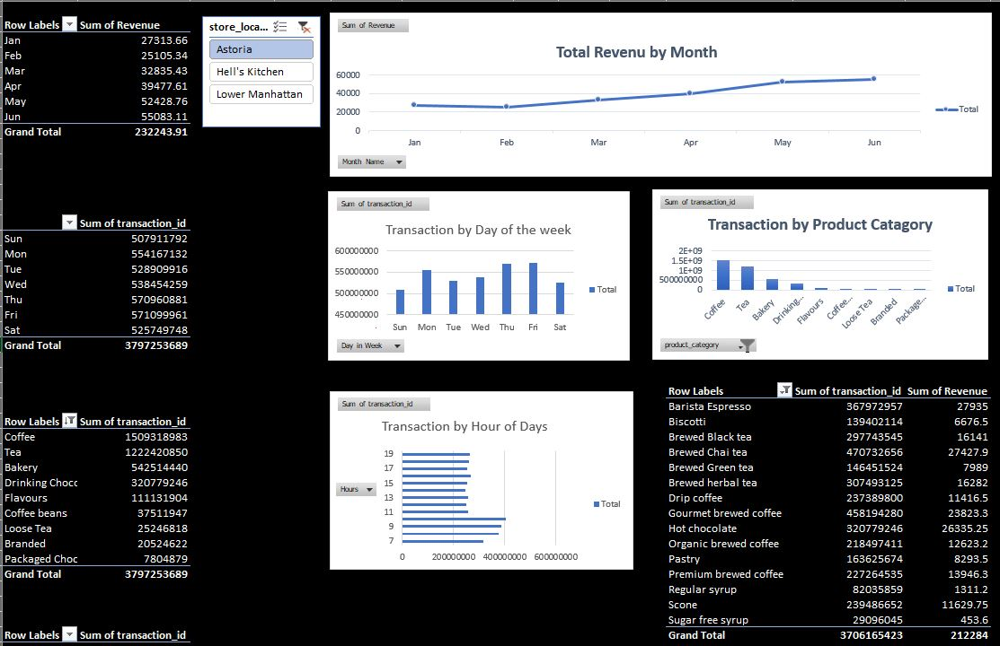

☕ Coffee Shop Sales Dashboard
 📌 Overview
This dashboard provides a comprehensive overview of sales performance, transaction trends, and product category insights for a multi-location coffee shop chain. It is designed to help stakeholders quickly understand revenue patterns, customer behavior, and operational efficiency across different time dimensions.

 🖼️ Dashboard Preview

> Figure 1: Full dashboard view showing revenue by month, transactions by day/week/hour, and product-level performance.


 📊 Key Metrics
- Total Revenue (Grand Total): $232,243.91  
- Total Transactions (Grand Total): 3,797,253,689  

 📈 Dashboard Components
 1. Revenue by Month
- Displays total revenue for each month from January to June.
- Highlights seasonal trends and monthly performance.
- Stores compared: Astoria, Hell's Kitchen, and Lower Manhattan.

 2. Transactions by Day of the Week
- Shows transaction volume from Sunday to Saturday.
- Helps identify peak days for staffing and promotions.
- Highest activity observed on Friday and Thursday.

 3. Transactions by Product Category
- Breaks down transaction counts by product type.
- Top categories include:
  - Coffee
  - Tea
  - Bakery
  - Hot Chocolate
  - Barista Espresso

 4. Transactions by Hour of Day
- Visualizes transaction distribution across operating hours.
- Useful for optimizing shift schedules and inventory management.

 5. Product-Level Revenue & Transaction Details
- Provides a detailed list of individual products with:
  - Total transaction count
  - Total revenue generated
- Examples:
  - Coffee – 1,509,319,983 transactions
  - Brewed Chai Tea – $27,427.90 revenue
  - Hot Chocolate – $26,335.25 revenue

 🧩 Data Granularity
- Location-level filtering (Astoria, Hell's Kitchen, Lower Manhattan)
- Time dimensions: Month, Day of Week, Hour of Day
- Product categorization: Drinks, Bakery, Flavours, Coffee Beans, etc.

 🎯 Use Cases
- Monitor monthly revenue trends and identify growth opportunities.
- Allocate staff and resources based on peak transaction days and hours.
- Evaluate product performance to optimize menu offerings.
- Compare store performance to support location-based decisions.

 🛠️ Tools Used
- Data Visualization: Excel / Power BI / Tableau (implied from dashboard layout)
- Data Source: Coffee shop POS transaction logs

 📁 File Structure
```
├── dataset
      ├── Coffee_Shop_Sales.xlsx
├──performance dashboard
      ├──Coffee Shop Sales dashboard.xlsx
├──Image_and_Other_Documnets
       ├── dashboard_Image.jpg
├── README.md
└── images/
    └── coff.JPG
```
 📬 Contact
For questions or further analysis, please reach out to the data analytics team.
